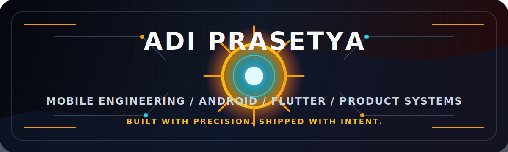

 

---

## About

I'm a **Mobile & Full-Stack Developer** who builds practical, polished, and maintainable applications. My main focus is **Android development with Kotlin**, supported by Flutter, Firebase, APIs, backend work, and the product details that make an app feel complete.

I care about clean user flows, reliable architecture, and small decisions that make software easier to use and easier to grow. Whether it is a new mobile app, a feature iteration, or improving an existing codebase, I like building things that feel sharp from the first screen to the final release.

## What I Build

<table>
  <tr>
    <td width="50%">
      <h3>Android Applications</h3>
      
Kotlin-based mobile apps with clean structure, API integration, Firebase, performance awareness, and a strong focus on user experience.

    </td>
    <td width="50%">
      <h3>Flutter Products</h3>
      
Cross-platform apps with clear screens, reusable components, and maintainable project structure.

    </td>
  </tr>
  <tr>
    <td width="50%">
      <h3>Backend & Dashboards</h3>
      
APIs, admin panels, database flows, deployment support, and the backend pieces needed to keep the product moving.

    </td>
    <td width="50%">
      <h3>Product Improvements</h3>
      
Bug fixing, refactoring, UI polish, feature iteration, and production-readiness work for apps that are already live or close to launch.

    </td>
  </tr>
</table>

## Toolkit

## Working Style

- I start with the product goal, then choose the technical path that supports it.
- I keep the codebase readable, predictable, and ready for future changes.
- I pay attention to the parts users actually feel: loading states, error states, empty states, navigation, and performance.
- I communicate clearly, move with intent, and care about shipping work that feels finished.

## Selected Work

<table>
  <tr>
    <td width="50%">
      <h3><a href="https://github.com/adiprasetyaa/GithubUserApp">GitHub User App</a></h3>
      
An Android app focused on API integration, user data presentation, and clean mobile UI patterns.

      
<strong>Kotlin</strong>

    </td>
    <td width="50%">
      <h3><a href="https://github.com/adiprasetyaa/RealMadridTopScorersApp">Real Madrid Top Scorers App</a></h3>
      
A Kotlin-based mobile app that presents football data in a simple, structured, and readable experience.

      
<strong>Kotlin</strong>

    </td>
  </tr>
  <tr>
    <td width="50%">
      <h3><a href="https://github.com/adiprasetyaa/desa-karangmalang-website">Village Website</a></h3>
      
A public-facing web project with content structure, navigation, and information delivery for local users.

      
<strong>JavaScript</strong>

    </td>
    <td width="50%">
      <h3><a href="https://github.com/adiprasetyaa/portofolio">Portfolio Website</a></h3>
      
A personal web presence designed to present identity, projects, and contact details in one place.

      
<strong>HTML</strong>

    </td>
  </tr>
</table>

## Open Source & GitHub Pulse

 
 

 
 

 
 

---

**Available for freelance, contract work, and collaboration on mobile-first products.**

 

<a href="mailto:adiprasetyaa11@gmail.com">
  <strong>Let's build something worth shipping.</strong>
</a>

